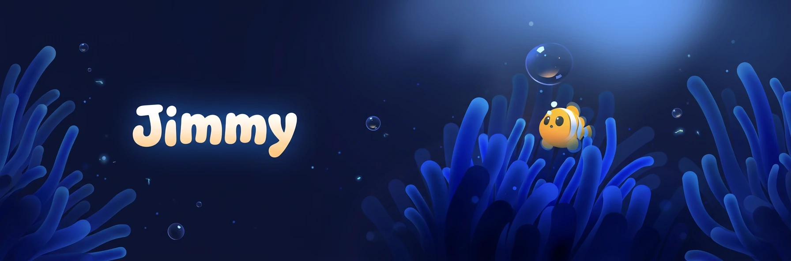

## About

I'm **Jimmy**, an indie game developer working with **Unity** and **C#**, and the modder known as **qopp** on [Nexus Mods](https://www.nexusmods.com/profile/qopp/mods).

My main project is **Refished**, a free fish life simulator where you grow, hunt and survive. I develop it solo in Unity 6, and it is actively updated.

**711** unique downloads across my mods, **600+** members in the Refished Discord and **2** published Subnautica mods.

### What I do

- **C# Programming:** mechanics, systems and game logic in Unity
- **Game Design:** gameplay, balancing and player experience
- **Modding & Porting:** BepInEx / Nautilus plugins, and QModManager to BepInEx ports
- **Translations:** content and documentation localization (Spanish / English)

I work with Unity 6 and Godot 4, in C#, GDScript and Luau, using BepInEx and Nautilus for modding. I'm open for **freelance** projects and collaborations.

## Featured Work

### Refished

A free fish life simulator: you spawn as a small fish, grow, hunt and try to survive. Playable in Survival, Hardcore and Deathmatch modes. Solo developed in Unity 6, actively updated, with release timing that varies by update size.

[Play on itch.io](https://j1mmyy.itch.io/refished) · [Discord](https://discord.gg/MBr2QaUfBg)

### Subnautica Mods

**[HoverFish Hats](https://www.nexusmods.com/subnautica/mods/2972)**, 604 unique downloads. Cosmetic mod adding six customizable hats for the Hoverfish, also visible on wild, free-swimming fish. Written in C# with BepInEx and Nautilus.

**[SNHardcorePlus: BepInEx Port](https://www.nexusmods.com/subnautica/mods/2980)**, 107 unique downloads. Port of qwiso's SNHardcorePlus to BepInEx and Nautilus, keeping the mod alive after QModManager. Around 30 configurable settings for Survival and Hardcore modes. Original concept and code by qwiso.

## GitHub Repos

**[HoverFish-Hats](https://github.com/jimmyy-67/HoverFish-Hats)** and **[SNHardcorePlus](https://github.com/jimmyy-67/SNHardcorePlus)**, the C# and BepInEx source behind my mods.

**[AquaRings](https://github.com/jimmyy-67/AquaRings)**, a water basketball toy for Windows, macOS and Linux made with Godot 4.7. Nine mini balls drift inside a tank with a hoop on the ceiling, and two pumps at the bottom push every ball at once.

**[CalculatorGD](https://github.com/jimmyy-67/CalculatorGD)** and **[Tree](https://github.com/jimmyy-67/Tree)**, small Godot projects where I learn GDScript properly.

**[jimmyy-67.github.io](https://github.com/jimmyy-67/jimmyy-67.github.io)**, the source of my portfolio site.

## GitHub Stats

  Unity is my main engine but it is not a GitHub language, so it does not appear above. The percentages only cover what is in my public repos.

## Get in Touch

[Portfolio](https://jimmyy-67.github.io/) · [Nexus Mods](https://www.nexusmods.com/profile/qopp/mods) · [itch.io](https://j1mmyy.itch.io/) · [Discord](https://discord.gg/MBr2QaUfBg) · [deeoqe@gmail.com](mailto:deeoqe@gmail.com)
